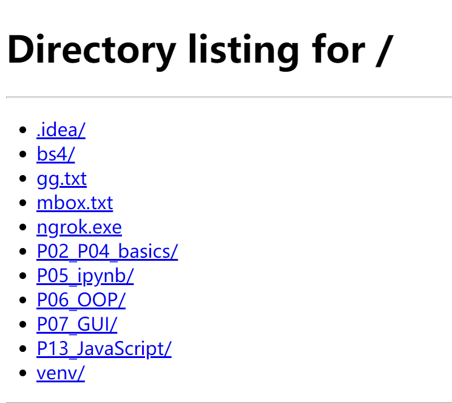
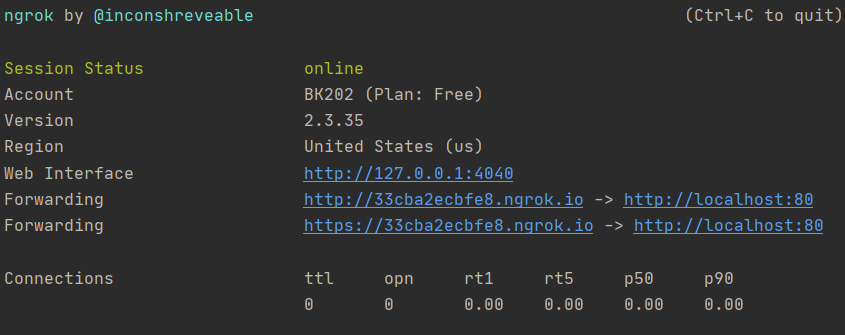
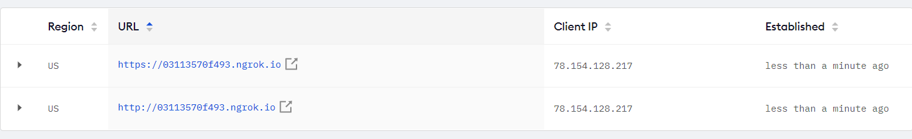

# Webserver through python
## 1) Use http.server module in python to create a localhost server
- type in: "python -m http.server XXXX" in terminal to start a localhost, XXXX is port code

- Localserver link: "Your ip address:XXXX" XXXX is port code
## 2) Download ngrok and use it to expose the server globally
- type in: "ngrok http XXXX" in terminal, XXXX is port code

## 3) Check if it works fine
- Use browser to open the ngrok link showed up in the "expose" page.

